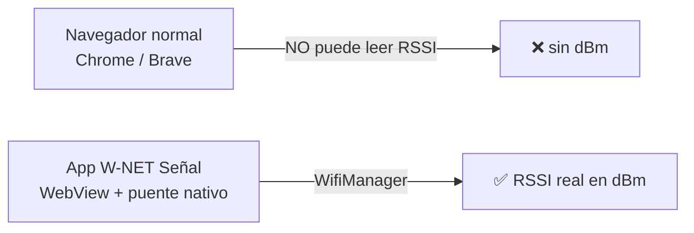
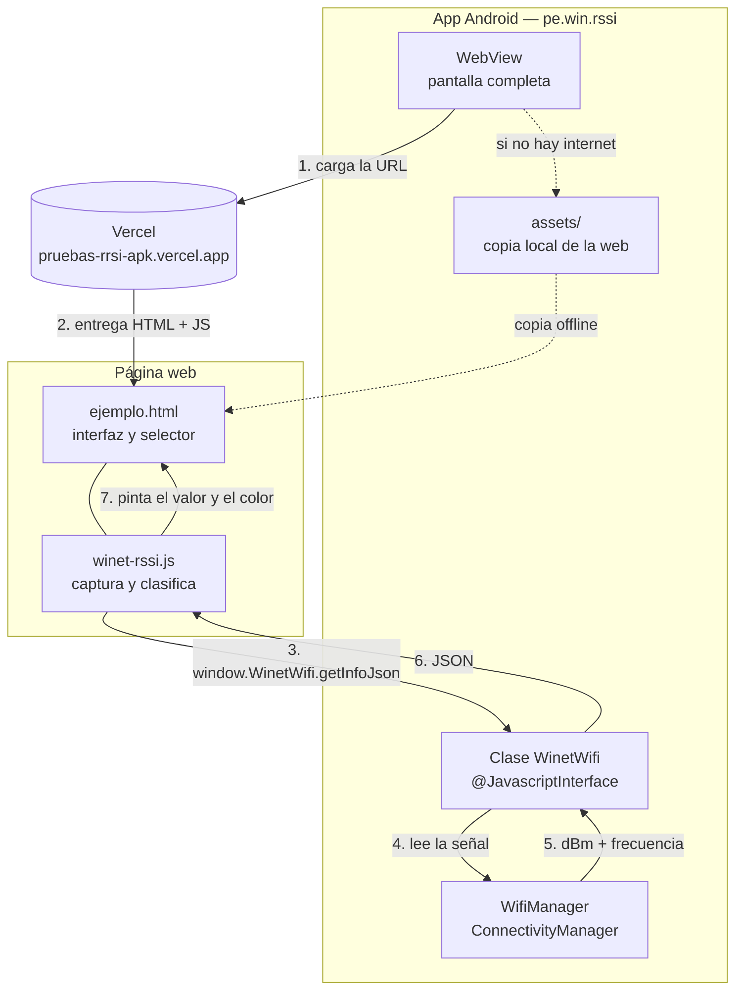
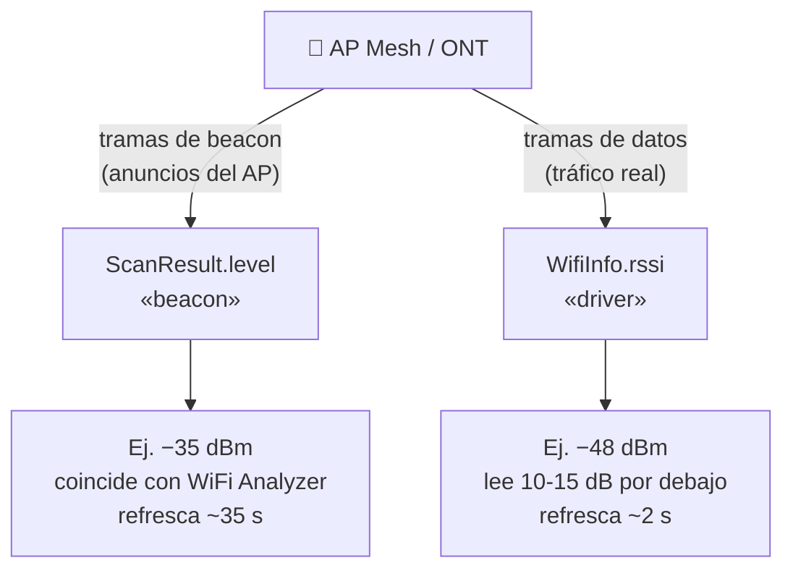
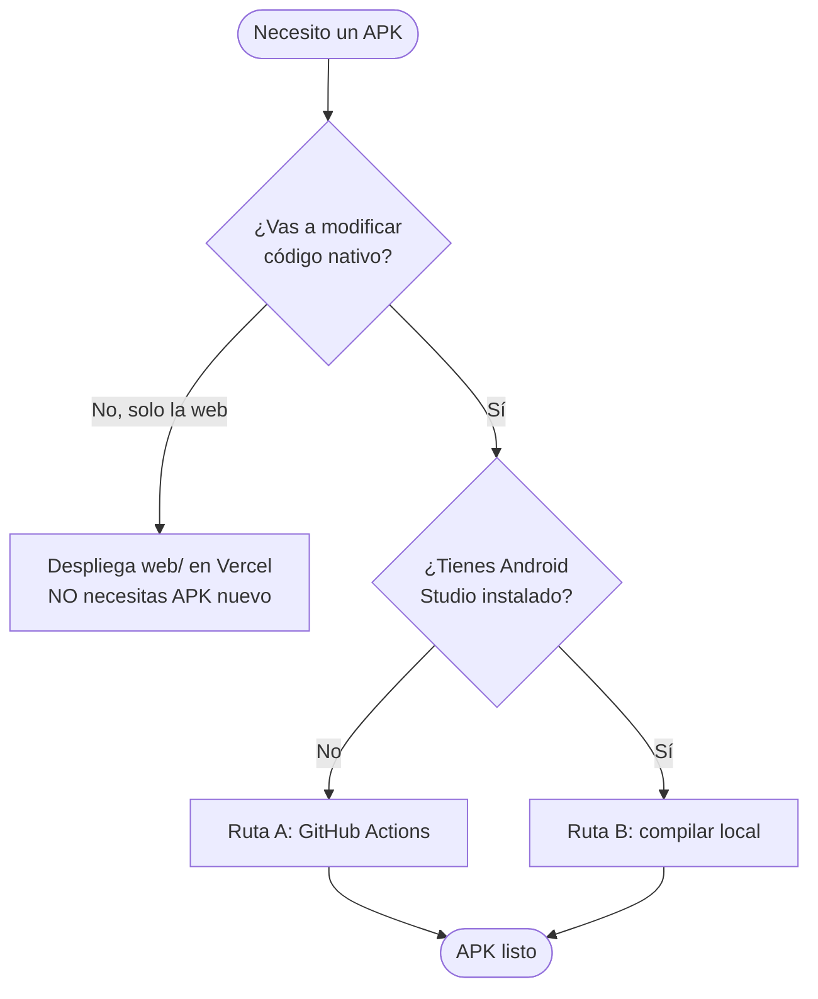
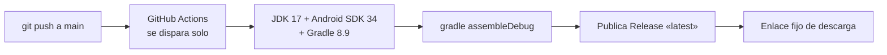
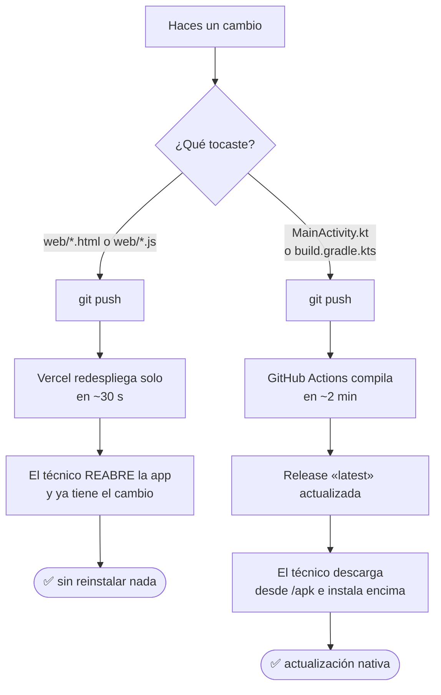

# Manual técnico — W-NET Señal

**Para:** el ingeniero que va a mantener y compilar esta aplicación.
**Versión del documento:** v1.1 · app `pe.win.rssi` versionCode 2
**Repositorio:** https://github.com/delacruzalarcoenrique-ai/Pruebas_RRSI_APK

> Este documento asume que sabes Android/Kotlin y JavaScript, pero **no** que conoces
> este proyecto. Empieza por la sección 1 y 2: explican *por qué* está hecho así, que
> es lo que más ahorra tiempo. Si solo necesitas compilar, salta a la **sección 8**.

---

## Índice

1. [Qué hace la aplicación](#1-qué-hace-la-aplicación)
2. [El problema técnico central](#2-el-problema-técnico-central)
3. [Arquitectura](#3-arquitectura)
4. [Cómo fluye una medición](#4-cómo-fluye-una-medición)
5. [Las dos fuentes de RSSI (lo más importante)](#5-las-dos-fuentes-de-rssi-lo-más-importante)
6. [Estructura del proyecto](#6-estructura-del-proyecto)
7. [Componentes en detalle](#7-componentes-en-detalle)
8. [Cómo compilar el APK](#8-cómo-compilar-el-apk)
9. [Ciclo completo de despliegue](#9-ciclo-completo-de-despliegue)
10. [Recetas: cómo cambiar cosas](#10-recetas-cómo-cambiar-cosas)
11. [Problemas frecuentes](#11-problemas-frecuentes)
12. [Firma del APK y seguridad](#12-firma-del-apk-y-seguridad)
13. [Glosario](#13-glosario)

---

## 1. Qué hace la aplicación

Los técnicos de campo de W-NET necesitan saber **con qué nivel de señal (RSSI, en dBm)
está conectado un dispositivo al AP Mesh / ONT del cliente**, para decidir si la
ubicación del equipo es adecuada.

La app muestra ese valor en vivo, con un color según la escala oficial de W-NET:

| Color | Calidad | Rango |
|---|---|---|
| 🟩 Verde oscuro | Óptima | −24 a −50 dBm |
| 🟢 Verde limón | Buena | −51 a −60 dBm |
| 🟡 Amarillo | Baja | −61 a −77 dBm |
| 🟧 Naranja | Débil | −78 a −84 dBm |
| 🟥 Rojo | Fuera de cobertura | −85 a −92 dBm |

El técnico puede además **elegir la fuente de medición** (ver sección 5), que es la
parte menos obvia del proyecto.

---

## 2. El problema técnico central

**Un navegador web no puede leer el RSSI.** No existe ninguna API de JavaScript que
devuelva el nivel de señal en dBm; `navigator.connection` solo da el tipo de red y
estimaciones de ancho de banda. Es una restricción de privacidad del navegador, no un
detalle que se pueda sortear.

W-NET ya tenía una página web (en Vercel) donde los técnicos hacen pruebas de
velocidad. La pregunta era: *¿cómo añadimos el RSSI a una página web?*

**La solución:** una app Android mínima que **carga esa misma página en un WebView** y
le inyecta el RSSI a través de un puente JavaScript. El RSSI lo lee código **nativo**
(que sí tiene acceso a `WifiManager`); la interfaz sigue siendo **web**.



**Consecuencia práctica que debes recordar:** si abres la página en Chrome verás el
mensaje *"Abre desde la app W-NET Señal"*. **Eso no es un error**: es el
comportamiento correcto cuando no existe el puente nativo.

---

## 3. Arquitectura



**Dos piezas independientes**, unidas por un contrato único (el objeto `WinetWifi`):

| Pieza | Responsabilidad | Cambiarla requiere… |
|---|---|---|
| **Nativa** (Kotlin) | Leer la señal del sistema y exponerla | recompilar el APK |
| **Web** (HTML + JS) | Interfaz, clasificación, selector | solo desplegar en Vercel |

> 💡 **Esto es clave para tu productividad:** cualquier cambio de interfaz, colores,
> umbrales o textos **no necesita recompilar el APK**. Se despliega en Vercel y llega
> a los técnicos al reabrir la app.

---

## 4. Cómo fluye una medición

Este es el ciclo que ocurre **cada segundo** mientras la app está abierta:

```mermaid
sequenceDiagram
    participant JS as winet-rssi.js
    participant BR as WinetWifi (Kotlin)
    participant AND as Android WifiManager
    participant UI as Pantalla

    Note over JS: setInterval cada 1000 ms
    JS->>BR: getInfoJson()
    BR->>AND: connectionInfo → rssi, frecuencia, BSSID
    BR->>AND: scanResults → nivel del BSSID conectado
    BR->>AND: NetworkCapabilities → signalStrength
    Note over BR: cada 35 s pide un escaneo nuevo
    AND-->>BR: datos de la señal
    BR-->>JS: JSON con las 3 fuentes
    Note over JS: elige la fuente configurada<br/>y clasifica según escala W-NET
    JS->>UI: evento winet:rssi + repinta widget
```

**Detalle importante sobre el refresco.** La pantalla se repinta cada segundo, pero
eso **no** significa que la medición se actualice cada segundo:

| Fuente | Se refresca realmente cada |
|---|---|
| Beacon (`scan`) | **~35 s** (Android limita a 4 escaneos por 2 minutos) |
| Driver (`link`) | ~1–3 s |

En el panel de diagnóstico de la app se muestra *"hace X s"*: es la antigüedad real
del dato de beacon.

---

## 5. Las dos fuentes de RSSI (lo más importante)

**Si solo vas a leer una sección de este manual, que sea esta.**

Android reporta el nivel de señal por vías distintas, y **no dan el mismo número**:



### Qué pasó durante el desarrollo

La primera versión usaba `WifiInfo.rssi` y mostraba **−48 dBm** mientras WiFi Analyzer,
en el mismo instante y en el mismo teléfono, mostraba **−35 dBm**. Una diferencia de
13 dB.

**No era un error de cálculo.** El código nunca hizo aritmética con el valor: eran
**dos mediciones diferentes del sistema operativo**. La del driver es una estimación
sobre tramas de datos, filtrada por el firmware; la de escaneo se mide sobre los
beacons del AP.

> ⚠️ **Regla del proyecto: NUNCA aplicar un offset fijo** (del tipo `rssi + 13`) para
> hacer coincidir los valores. Fue descartado explícitamente por W-NET: un offset es
> falso a otras distancias y bandas. Si un valor no cuadra, **se corrige la fuente**,
> no el número.

W-NET toma como referencia válida la medición de **beacon**, porque es la que
reportan los analizadores WiFi que el equipo usa como patrón.

### Cómo quedó implementado

El puente devuelve **las tres fuentes a la vez** y el técnico elige en la interfaz:

| Botón en la app | Fuente | Cuándo usarlo |
|---|---|---|
| **Beacon** | `ScanResult.level` | Medición oficial, para registrar el valor |
| **Driver** | `WifiInfo.rssi` | Ver la tendencia en vivo al caminar buscando el mejor punto |
| **Auto** | beacon si existe, si no driver | Comportamiento por defecto |

La elección se guarda en `localStorage` del WebView, así que persiste entre sesiones.

**Caso borde manejado:** si el técnico elige *Beacon* pero todavía no hay un escaneo
del BSSID conectado, la app usa el driver **y lo dice en pantalla**
(*"Driver (esperando escaneo)"*). Nunca presenta un dato como si fuera el otro.

### Para acelerar el refresco del beacon

En el teléfono: **Ajustes → Opciones de desarrollador → desactivar "Limitación de
búsqueda de redes Wi-Fi"** (*Wi-Fi scan throttling*). Con eso los escaneos pueden ser
mucho más frecuentes. Es la misma limitación de la que WiFi Analyzer advierte.

---

## 6. Estructura del proyecto

```
winet-senal/
├─ MANUAL-TECNICO.md          ← este documento
├─ README.md                   guía rápida
├─ settings.gradle.kts         módulos del proyecto
├─ build.gradle.kts            versiones de AGP y Kotlin
├─ gradle.properties           flags de Gradle (sin AndroidX)
├─ vercel.json                 atajo /apk del sitio
├─ index.html                  raíz del sitio en Vercel
│
├─ app/
│  ├─ build.gradle.kts         config del módulo, FIRMA y tarea copiarWeb
│  ├─ winet-debug.keystore     clave de firma (ver sección 12)
│  └─ src/main/
│     ├─ AndroidManifest.xml   permisos y actividad
│     ├─ java/pe/win/rssi/
│     │  └─ MainActivity.kt    ⭐ TODO el código nativo
│     └─ res/                  íconos vectoriales y strings
│
├─ web/                        ⭐ fuente única de la interfaz
│  ├─ ejemplo.html             UI: medidor, selector, diagnóstico
│  ├─ winet-rssi.js            librería de captura y clasificación
│  └─ winet-rssi.test.js       pruebas (Node)
│
├─ .github/workflows/
│  └─ build-apk.yml            CI: compila el APK y publica la Release
│
└─ docs/superpowers/           especificación y plan de diseño originales
```

Solo hay **dos archivos con lógica real**: `MainActivity.kt` (nativo) y
`winet-rssi.js` (web). Todo lo demás es configuración o documentación.

> `app/src/main/assets/` **no está en el repositorio**: lo genera Gradle en cada
> compilación copiando `web/`. No lo edites ahí, se sobrescribe.

---

## 7. Componentes en detalle

### 7.1 `MainActivity.kt` — el lado nativo

Contiene dos clases:

**`MainActivity`** — pide el permiso de ubicación, crea el WebView, registra el puente
y carga la URL. Si la carga remota falla, cae a la copia local de los assets.

```kotlin
private val webUrl = "https://pruebas-rrsi-apk.vercel.app/web/ejemplo.html"
private val urlRespaldo = "file:///android_asset/ejemplo.html"
```

**`WinetWifi`** — el puente. Métodos expuestos a JavaScript:

| Método | Devuelve |
|---|---|
| `getInfoJson()` | JSON con todo (el que realmente se usa) |
| `getRssi()` | `Int` en dBm |
| `getBand()` | `"2.4 GHz"` / `"5 GHz"` / `"6 GHz"` / `""` |

Contrato de `getInfoJson()`:

```json
{
  "rssi": -35,              // el valor preferido (beacon si existe)
  "source": "scan",         // de dónde salió: "scan" o "link"
  "rssiScan": -35,          // beacon, o null si no hay escaneo del BSSID
  "rssiLink": -48,          // driver
  "rssiCaps": -48,          // NetworkCapabilities (solo diagnóstico)
  "scanAgeMs": 2500,        // antigüedad del escaneo, -1 si no aplica
  "frequencyMhz": 5560,
  "band": "5 GHz",
  "bssid": "6c:11:ba:91:87:ee",
  "linkSpeedMbps": 573,
  "available": true         // false si no hay WiFi o falta el permiso
}
```

⚠️ **Si cambias este JSON, debes actualizar `readNative()` en `winet-rssi.js`.** Es el
único punto de acoplamiento entre las dos piezas.

Notas de implementación que conviene no romper:

- `@JavascriptInterface` es **obligatorio** en cada método expuesto. Sin esa anotación
  el método no es visible desde JS (API 17+).
- `WifiManager.connectionInfo` está deprecado en API 31+ pero sigue operativo; está
  marcado con `@Suppress("DEPRECATION")`. Migrar a `ConnectivityManager` +
  `NetworkCapabilities` es una mejora pendiente.
- `getSignalStrength()` se invoca **por reflexión** a propósito, para que el proyecto
  compile en cualquier SDK aunque el método no esté expuesto. No lo cambies a llamada
  directa sin verificar la compilación.
- `scanRequestIntervalMs = 35_000` — con 30 s se roza el límite de Android y algunas
  solicitudes de escaneo se descartan silenciosamente.
- No se implementa `onRequestPermissionsResult` y **no hace falta**: la web consulta el
  puente cada segundo y Android evalúa el permiso en cada llamada, así que en cuanto
  el técnico lo concede el valor aparece en ~1 s.

### 7.2 `winet-rssi.js` — el lado web

Librería sin dependencias. Funciona igual dentro de la app, en un navegador normal
(degradada) y en Node (para pruebas).

API pública en `window.WinetRSSI`:

| Función | Qué hace |
|---|---|
| `classify(rssi)` | Devuelve `{quality, label, color}` según la escala W-NET |
| `getWifiSignal()` | Lectura completa actual |
| `getSource()` / `setSource(f)` | Lee o cambia la fuente: `'scan'`, `'link'`, `'auto'` |
| `start(ms)` / `stop()` | Controla el sondeo (arranca solo cada 1000 ms) |
| `mount(selector)` | Monta el widget visual ya hecho |
| `hasBridge()` | `true` si corre dentro de la app |

Además emite un **evento en `document`** cada ciclo, que es la forma recomendada de
integrarla en cualquier interfaz:

```js
document.addEventListener('winet:rssi', function (e) {
  var s = e.detail;   // { rssi, band, quality, label, color, sourceUsed, ... }
  // ...pinta lo que quieras...
});
```

### 7.3 La clasificación W-NET

En `classify()`. **Es la lógica de negocio del proyecto** y está cubierta por pruebas:

```js
if (rssi == null || rssi === 0 || rssi <= -127) → 'na'      // sin dato
if (rssi >= -50) → 'optima'   // #0F7B0F
if (rssi >= -60) → 'buena'    // #7CB518
if (rssi >= -77) → 'baja'     // #E6B800
if (rssi >= -84) → 'debil'    // #E8720C
else             → 'fuera'    // #D32F2F
```

`-127` es el valor centinela que devuelve Android cuando no hay señal válida.

---

## 8. Cómo compilar el APK

Hay dos caminos. **El recomendado es el primero**, porque es el que se usa en
producción y no requiere instalar nada.



### Ruta A — GitHub Actions (recomendada, sin instalar nada)

El repositorio ya trae el workflow configurado. El proceso es:



**Pasos concretos:**

1. Haz tus cambios y súbelos:
   ```bash
   git push origin main
   ```
2. Entra a la pestaña **Actions** del repositorio. El workflow *Build APK* arranca
   automáticamente (tarda ~2 minutos).
3. Cuando termine en verde, el APK queda disponible en **dos sitios**:
   - **Enlace fijo** (el que usan los técnicos, nunca cambia):
     `https://pruebas-rrsi-apk.vercel.app/apk`
   - Artifact `winet-senal-debug` dentro de la ejecución del workflow.

También puedes lanzarlo a mano con **Actions → Build APK → Run workflow**, sin
necesidad de un push.

### Ruta B — Compilar en tu máquina

**Requisitos:** JDK 17 y Android Studio (Ladybug o superior) o Gradle 8.9.

⚠️ **Aviso importante: el repositorio NO incluye el Gradle Wrapper** (se omitió a
propósito para no versionar el `.jar` binario; el CI usa el Gradle que provee la
acción). Por eso `./gradlew` **no existe** todavía.

**Con Android Studio** (lo más simple):

1. `File → Open` y selecciona la carpeta raíz del proyecto.
2. Android Studio detecta que falta el wrapper y descarga el Gradle adecuado solo.
   Acepta la sincronización cuando lo pida.
3. `Build → Build App Bundle(s) / APK(s) → Build APK(s)`.
4. El APK aparece en:
   ```
   app/build/outputs/apk/debug/app-debug.apk
   ```

**Con Gradle por línea de comandos:**

```bash
gradle assembleDebug
```

Si prefieres tener `./gradlew` disponible, genéralo una vez:

```bash
gradle wrapper --gradle-version 8.9
```

**Versiones fijadas del proyecto** (no las cambies sin motivo, están verificadas):

| Componente | Versión |
|---|---|
| Android Gradle Plugin | 8.5.2 |
| Kotlin | 1.9.24 |
| Gradle | 8.9 |
| JDK | 17 |
| compileSdk / targetSdk | 34 |
| minSdk | 26 (Android 8) |

Sin AndroidX y **sin dependencias externas**: todo sale de las APIs de plataforma. Eso
mantiene el APK en ~800 KB y la compilación en menos de 2 minutos.

### Verificar el lado web

```bash
node web/winet-rssi.test.js
```

Debe imprimir `OK: 14 umbrales de clasificación pasaron`. Si tocas `classify()`,
**esta prueba debe seguir pasando**.

### Qué hace Gradle antes de compilar

La tarea `copiarWeb` (definida en `app/build.gradle.kts`) copia `web/*.html` y
`web/*.js` a `app/src/main/assets/` en cada build. Así el APK lleva una **copia
offline** de la interfaz. Es indispensable: el técnico suele estar en sitios donde el
internet del cliente está caído, que es justo cuando lo llaman.

---

## 9. Ciclo completo de despliegue

Entender esto evita trabajo innecesario:



**La distinción práctica:**

| Cambio | ¿Requiere APK nuevo? |
|---|---|
| Colores, textos, umbrales, layout, selector | ❌ No — solo Vercel |
| Nueva lectura del sistema, permisos, WebView | ✅ Sí |
| Refrescar la copia offline dentro del APK | ✅ Sí (pero no urge) |

Como el push dispara **ambos** (Vercel y GitHub Actions), en la práctica solo haces
`git push` y ambos caminos se actualizan.

---

## 10. Recetas: cómo cambiar cosas

### Cambiar la URL que carga la app

`app/src/main/java/pe/win/rssi/MainActivity.kt`:

```kotlin
private val webUrl = "https://TU-NUEVA-URL"
```

Requiere recompilar el APK (Ruta A o B).

### Cambiar los umbrales o colores de la escala

`web/winet-rssi.js`, función `classify()`. Actualiza también los casos de
`web/winet-rssi.test.js` y corre la prueba. **No requiere APK nuevo.**

### Cambiar la velocidad de refresco de la pantalla

`web/winet-rssi.js`, al final: `start(1000)` → los milisegundos que quieras.
Recuerda que la medición de beacon no se refresca más rápido que el escaneo.

### Cambiar el intervalo de escaneo

`MainActivity.kt`: `scanRequestIntervalMs`. **No bajes de 30 s**: Android limita a 4
escaneos por 2 minutos y las solicitudes extra se descartan sin avisar.

### Integrar el medidor en otra página (por ejemplo el speedtest)

Incluye el script y engancha el evento:

```html
<script src="/winet-rssi.js"></script>
<script>
  document.addEventListener('winet:rssi', function (e) {
    var s = e.detail;
    // s.rssi, s.label, s.color, s.band, s.sourceUsed
  });
</script>
```

O usa el widget ya hecho: `WinetRSSI.mount('#miDiv')`.

### Añadir un dato nuevo del sistema (ej. el canal)

1. En `WinetWifi.getInfoJson()` añade el campo al JSON.
2. En `readNative()` de `winet-rssi.js` propágalo.
3. En `getWifiSignal()` inclúyelo en el objeto devuelto.
4. Úsalo en `ejemplo.html`.
5. Recompila el APK (cambió código nativo).

---

## 11. Problemas frecuentes

| Síntoma | Causa y solución |
|---|---|
| **"Abre desde la app W-NET Señal"** en el navegador | Correcto por diseño. El navegador no puede leer el RSSI; hay que usar la app. |
| **No aparece el dBm dentro de la app** | Falta el permiso de ubicación o la ubicación del teléfono está apagada. Android lo exige para leer datos del WiFi. |
| **La descarga del APK parece congelada** | Chrome/Brave marcan los `.apk` como peligrosos y dejan la descarga esperando confirmación. Abrir notificaciones o `⋮ → Descargas` y tocar *"Descargar de todos modos"*. |
| **"App no instalada" al actualizar** | Firma distinta a la del APK ya instalado. Desinstalar y volver a instalar. Ocurre si se cambió la keystore (ver sección 12). |
| **El valor de beacon no cambia al moverse** | Normal: se refresca cada ~35 s. Usar la fuente *Driver* para ver la tendencia en vivo, o desactivar la limitación de escaneo en Opciones de desarrollador. |
| **El dBm no coincide con un analizador WiFi** | Verificar qué fuente está seleccionada. *Beacon* debe coincidir; *Driver* lee 10–15 dB por debajo. Ver sección 5. **No aplicar offsets.** |
| **La app muestra una interfaz vieja** | El WebView cargó la copia offline (no había internet) o cache. Cerrar y reabrir con conexión. |
| **Falla `./gradlew`** | No existe el wrapper. Usar Android Studio o generarlo: `gradle wrapper --gradle-version 8.9`. |
| **El CI falla al compilar** | Revisar el log en Actions. Causa típica: cambio de versión de AGP/Gradle incompatible, o una API llamada sin guardar la compatibilidad de SDK. |

---

## 12. Firma del APK y seguridad

### Cómo está ahora

El proyecto incluye `app/winet-debug.keystore` y lo usa para firmar el build de debug:

```kotlin
signingConfigs {
    getByName("debug") {
        storeFile = file("winet-debug.keystore")
        storePassword = "winetsenal"
        keyAlias = "winet"
        keyPassword = "winetsenal"
    }
}
```

### Por qué

Sin una clave fija, **cada compilación en GitHub Actions generaba una
`debug.keystore` nueva** (el runner arranca limpio), y Android rechaza instalar una
actualización firmada con otra clave. Los técnicos tenían que desinstalar en cada
actualización. Con la clave fija, instalan encima sin problema.

### ⚠️ Advertencia que debes atender

Esta clave es autofirmada, de uso interno, y **estuvo en un repositorio público**:
debe considerarse **comprometida**. Recomendación para producción:

1. Generar una clave nueva:
   ```bash
   keytool -genkeypair -v -keystore winet-release.keystore \
     -alias winet -keyalg RSA -keysize 2048 -validity 10000
   ```
2. Guardarla como **secret** del repositorio (base64) y decodificarla en el workflow.
   **No versionarla.**
3. Si se publica en Play Store, usar una clave de release propia y Play App Signing.

**Consecuencia práctica:** al cambiar la clave, todos los equipos con la app instalada
deberán **desinstalarla una vez** antes de actualizar. Conviene avisar al equipo de
campo antes de hacerlo.

### Permisos que solicita la app

| Permiso | Para qué |
|---|---|
| `INTERNET` | Cargar la página web |
| `ACCESS_WIFI_STATE` | Leer el estado y nivel del WiFi |
| `ACCESS_NETWORK_STATE` | Consultar la red activa |
| `ACCESS_FINE_LOCATION` | **Exigido por Android** para acceder a datos del WiFi |

No se recolecta ni se envía ninguna posición geográfica: el permiso de ubicación es un
requisito del sistema operativo para exponer información de redes WiFi.

---

## 13. Glosario

| Término | Significado |
|---|---|
| **RSSI** | *Received Signal Strength Indicator*. Nivel de señal recibida, en dBm. Siempre negativo; más cerca de 0 es mejor. −35 es excelente, −85 es muy malo. |
| **dBm** | Decibelio-milivatio. Escala logarítmica: cada 3 dB menos ≈ la mitad de potencia. |
| **Beacon** | Trama que el AP emite periódicamente anunciándose. Base de la medición de escaneo. |
| **BSSID** | MAC del punto de acceso concreto. En una red Mesh identifica **a qué nodo** está pegado el dispositivo. |
| **STA** | *Station*. El dispositivo cliente (el celular del técnico). |
| **AP** | *Access Point*. El punto de acceso (router, nodo Mesh, ONT). |
| **ONT** | *Optical Network Terminal*. Equipo de fibra en casa del cliente. |
| **WebView** | Componente Android que renderiza páginas web dentro de una app nativa. |
| **Puente JS** | Objeto Java/Kotlin expuesto a JavaScript mediante `addJavascriptInterface`. |
| **Scan throttling** | Límite de Android al número de escaneos WiFi por intervalo (4 cada 2 min). |
| **AGP** | *Android Gradle Plugin*. |

---

## Resumen en una página

- La app es un **WebView con un puente nativo**, porque el navegador no puede leer el RSSI.
- Todo el código nativo está en **`MainActivity.kt`**; toda la interfaz en **`web/`**.
- **Cambios de interfaz no requieren APK nuevo** — se despliegan en Vercel.
- Hay **dos fuentes de RSSI** (beacon ≈ analizadores, driver ≈ en vivo) y el técnico
  elige. **Nunca aplicar offsets** para hacerlas coincidir.
- Para compilar: `git push` y GitHub Actions lo hace, o Android Studio en local
  (ojo: **no hay Gradle Wrapper**).
- La **keystore del repo debe rotarse** antes de considerar esto producción.
